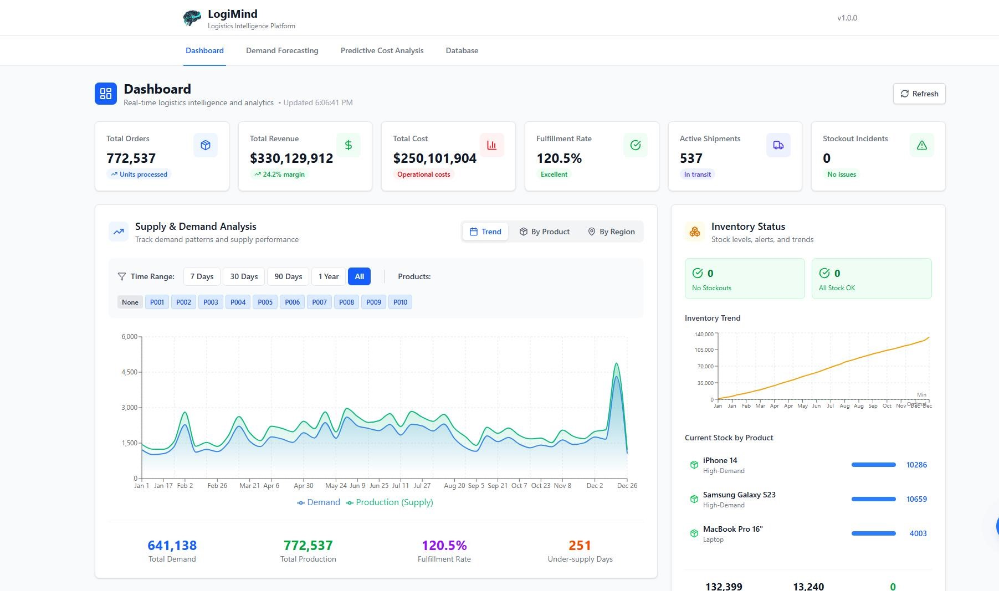

# LogiMind


**Logistics Intelligence Platform**

---

## Description

LogiMind is a comprehensive logistics intelligence platform that provides real-time analytics, demand forecasting, and predictive cost analysis for supply chain management. Built with React, TypeScript, and Electron, it offers both web and desktop experiences with seamless data synchronization.

### Key Features

- **Dashboard** — Real-time KPIs, supply & demand charts, inventory status, and shipment tracking
- **Demand Forecasting** — Statistical predictions with confidence intervals and trend analysis
- **Predictive Cost Analysis** — Cost trend analysis, supplier performance, and anomaly detection
- **Database Management** — Generate, view, edit, and export logistics data (365 days × 10 products)
- **Cross-Platform** — Runs in any modern web browser or as a native Windows desktop app
- **Shared Data Source** — Web and desktop versions sync through a unified Express server

### Tech Stack

| Layer | Technology |
|-------|-----------|
| Frontend | React 19 + TypeScript + Vite |
| Styling | Tailwind CSS 4 |
| Charts | Recharts |
| Backend | Express.js |
| Desktop | Electron 40 |
| Build | electron-builder |

---

## Screenshots

> [Screenshots.pdf](ScreenShots.pdf)
 

---

## Getting Started

### Prerequisites

- **Node.js** (v18 or higher)
- **npm** (v9 or higher)
- **Git**

### Installation

```bash
# Clone the repository
git clone https://github.com/<your-username>/logimind.git
cd logimind

# Install dependencies
npm install
```

### Running the Web Version

```bash
npm run dev
```

Then open your browser to **http://localhost:5173**

The Express server will automatically start on **http://localhost:3000**

### Running the Desktop App (Electron)

```bash
npm run electron:dev
```

This starts both the Express server and the Electron desktop window.

### Building for Production

```bash
# Build the web app
npm run build

# Build the Windows installer
npm run electron:build
```

The installer will be created in the `release/` folder.

---

## Project Structure

```
logimind/
├── electron/              # Electron main process
│   ├── main.js
│   └── preload.js
├── public/                # Static web assets
│   ├── logo.png
│   └── vite.svg
├── scripts/               # Build/dev scripts
│   └── dev.js
├── src/                   # React source code
│   ├── components/        # UI components
│   │   └── dashboard/     # Dashboard widgets
│   ├── data/              # Data generators
│   ├── types/             # TypeScript types
│   ├── utils/             # Utility functions
│   ├── App.tsx
│   └── main.tsx
├── build/                 # Build resources (icons)
├── server.js              # Express backend
├── Database.json          # Data store
├── package.json
└── vite.config.ts
```

---

## How It Works

### Data Flow

1. The **Express server** (`server.js`) manages all data operations on `Database.json`
2. The **web version** fetches data via `fetch('http://localhost:3000/api/data')`
3. The **Electron version** uses IPC to call the same server API
4. Both versions share the **same data source** — changes in one are visible in the other

### API Endpoints

| Method | Endpoint | Description |
|--------|----------|-------------|
| GET | `/api/data` | Load all records |
| POST | `/api/save` | Save records |
| POST | `/api/clear` | Clear all records |

---

## Development

### Available Scripts

| Command | Description |
|---------|-------------|
| `npm run dev` | Start Vite dev server + Express server |
| `npm run dev:electron` | Start Express server + Electron app |
| `npm run electron:dev` | Alias for `dev:electron` |
| `npm run build` | TypeScript check + Vite production build |
| `npm run electron:build` | Build Windows installer |
| `npm run server` | Start Express server only |
| `npm run preview` | Preview production build |
| `npm run lint` | Run ESLint |

### Generating Sample Data

Open the **Database** tab in the app and click **Generate Data** to create 3,650 sample records (10 products × 365 days).

---

## Author

**Zalan Lykos**

- Website: [zalanlykos.github.io](https://zalanlykos.github.io)

---

## License

Copyright (c) 2024 Zalan Lykos. All rights reserved.
